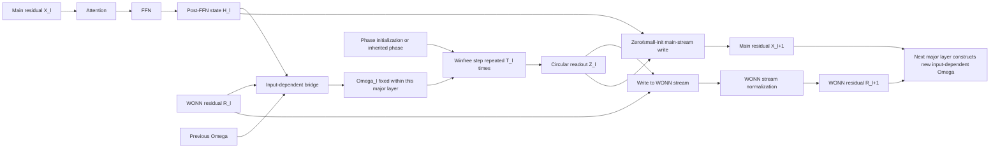

# Beyond The First Stars 初星之晨 · 更加遥远的天空

**Date:** 2026-08-27  
**Status:** Speculative architecture agenda; no language-model result is claimed  
**Scope:** Reasoning-specific oscillatory state, persistent multi-stream routing,
and native-pretraining or retrofit experiments beyond ordinary local
Expressivity Engineering

## 1. Thesis

The earlier Expressivity Engineering (EE) agenda changes the local functional
form of a model: multiplicative gates, dynamic weights, higher-order
interactions, or structured side paths make a layer more expressive while the
model still communicates principally through the ordinary residual stream.

This note studies a more radical possibility. A Transformer can retain its
ordinary Attention and feed-forward network (FFN) for factual retrieval,
factual storage, and general representation learning, while a second,
WONN-like dynamical system is attached as a persistent reasoning stream. The
new stream is not merely another local activation. It has its own state, its
own fast recurrence, its own cross-layer persistence, and an explicitly slower
input-dependent frequency update.

The central proposal is:

> After the ordinary Attention--FFN computation of each major Transformer
> layer, run a Winfree Oscillatory Neural Network (WONN)-like reasoning
> component. Hold one input-dependent frequency state $\Omega_l$ fixed during
> the component's $T_l$ fast phase updates, then construct a new
> input-dependent $\Omega_{l+1}$ when crossing into the next major layer. Send
> the component's readout both into the main Transformer stream and forward
> through a dedicated WONN residual stream.

This is deliberately broader than the completed TriGLU experiment. It is an
architecture hypothesis about separating *where information is stored and
retrieved* from *where iterative logical organization is performed*.

## 2. Evidence boundary and source corrections

This proposal is motivated by the
[Winfree Oscillatory Neural Network paper](https://arxiv.org/abs/2605.20922),
its [official implementation](https://github.com/Jiawen-Dai/WONN), and the
frequency-oriented intuition shared by recurrent brain-inspired systems such
as HRM. The architectural extrapolation to language models is new and is not a
claim made by the WONN authors.

Several source boundaries matter:

1. **The published WONN result is not a causal language-model result.** The
   paper evaluates image recognition, Maze-hard, and a standard 9-by-9 Sudoku
   dataset. Language modeling, autoregressive decoding, and a persistent
   Transformer-side oscillator stream remain untested.
2. **The paper reports perfect in-distribution Sudoku accuracy, not a separately
   identified "Sudoku Extreme" benchmark.** WONN with $T=16$ reports
   $100.0\%\pm0.0$ over five runs on 1,000 held-out boards from the same
   distribution, with 1.58M parameters. The result is strong evidence of an
   efficient structured reasoner, but the dataset name and scope should not be
   overstated.
3. **The clearest hard-reasoning efficiency result is Maze-hard.** WONN uses
   0.396M parameters and reports 76.2% accuracy, or 80.1% after energy voting
   over 32 sampled trajectories. The latter therefore includes nontrivial
   test-time selection. The paper establishes parameter efficiency; it does
   not establish that WONN universally uses less test-time compute than every
   recurrent alternative.
4. **WONN does not simply mean "a Conv2d reasoner."** The paper uses global
   attentive coupling for all reported WONN models. Convolution appears as a
   local-coupling alternative and in spatial layer-transition/readout modules.
   The official Sudoku model likewise uses attentive coupling, although its
   phase/frequency transitions and output head retain the 9-by-9 grid prior.
5. **The natural frequency $\Omega$ is a per-example state, not a learned
   parameter table shared unchanged by every input.** In the original model,
   the input initializes $\Omega^{(0)}=f_{\mathrm{init}}(x)$; phase starts from
   small random noise; and later layers update both phase and frequency.

These corrections strengthen rather than weaken the research question. WONN
already demonstrates that a small oscillatory state can solve structured tasks;
the open problem is how to translate that inductive bias into a causal language
architecture without importing an inappropriate image-grid prior.

## 3. A concise WONN primer

### 3.1 Dual state and two timescales

WONN maintains two states:

- $\Theta\in(S^1)^m$: $m$ circular phase variables, represented modulo
  $2\pi$;
- $\Omega\in\mathbb{R}^m$: an input-dependent natural-frequency state.

Within dynamical layer $l$, $\Omega_l$ remains fixed while the phase is updated
$T_l$ times. A simplified update is

$$
\Theta_l^{(t+1)}=
\operatorname{wrap}\!\left(
\Theta_l^{(t)}+\gamma_l
\left[
\Omega_l
+S_l(\Theta_l^{(t)})\odot
\mathcal{C}_l\!\left(I_l(\Theta_l^{(t)})\right)
\right]
\right),
$$

where:

- $t\in\{0,\ldots,T_l-1\}$ is the fast inner-step index;
- $\gamma_l$ is the discretization step size;
- $S_l$ is the oscillator sensitivity function;
- $I_l$ is the oscillator influence function;
- $\mathcal{C}_l$ aggregates or communicates influence across oscillators;
- $\odot$ denotes element-wise multiplication;
- $\operatorname{wrap}$ maps angles back to a fixed interval such as
  $[-\pi,\pi)$.

The original trigonometric Sudoku implementation uses
$S(\theta)=\cos\theta$ and $I(\theta)=\sin\theta$. Its coupling operator is an
attention module followed by normalization and a nonlinearity.

After $T_l$ fast updates, the original architecture performs a slower layer
transition:

$$
\Theta_{l+1}^{(0)}=\operatorname{ThetaUpdate}_l(\Theta_l^{(T_l)}),
\qquad
\Omega_{l+1}=\operatorname{OmegaUpdate}_l
(\Omega_l,\Theta_l^{(T_l)}).
$$

This fast-phase/slow-frequency decomposition is the part most directly reused
here.

### 3.2 What the Sudoku input actually becomes

In the official Sudoku implementation, each input digit token indexes a learned
frequency template. The result is an input-dependent $\Omega$ tensor over the
9-by-9 board and oscillator channels. The phase is initialized as small random
noise, approximately $0.1\,\mathcal{N}(0,I)$, rather than being a deterministic
encoding of the Sudoku digit. Given-cell frequency embeddings are re-added at
later transitions so that the constraints remain anchored.

This suggests an important language-model baseline:

```text
post-FFN hidden state -> learned frequency state Omega
small random phase   -> repeated Winfree updates under fixed Omega
settled phase        -> readout and next-layer state transition
```

It also motivates deterministic and persistent alternatives, discussed in
Section 6, because stochastic phase initialization at every autoregressive
layer or token may be undesirable for serving and reproducibility.

## 4. Proposed dual-stream architecture

### 4.1 State definitions

Let:

- $B$ be batch size;
- $N$ be sequence length;
- $d$ be the Transformer hidden width, for example 8,192;
- $m$ be a smaller oscillator width;
- $l$ index a major Transformer layer;
- $t$ index a fast WONN step.

The architecture maintains:

$$
X_l\in\mathbb{R}^{B\times N\times d},
\quad
R_l\in\mathbb{R}^{B\times N\times d_r},
\quad
\Theta_l^{(t)}\in(S^1)^{B\times N\times m},
\quad
\Omega_l\in\mathbb{R}^{B\times N\times m}.
$$

$X_l$ is the ordinary main residual stream. $R_l$ is a dedicated persistent
WONN residual stream. $\Theta$ and $\Omega$ are the circular phase and Euclidean
frequency states internal to the reasoning component. In the simplest design,
$d_r=m$; wider or factorized readout streams remain possible.

### 4.2 One major layer

The primary placement is after the complete Attention--FFN block:

$$
H_l=\operatorname{TransformerBlock}_l(X_l).
$$

The bridge constructs a new input-dependent frequency for this major layer:

$$
\Omega_l=f_{\Omega,l}
\left(
\operatorname{Norm}(H_l),
\operatorname{Norm}(R_l),
\Omega_{l-1}
\right).
$$

The same $\Omega_l$ is held fixed for all $T_l$ fast updates. After the phase
dynamics settle, a circular readout embeds the final phase:

$$
Z_l=E_{\Theta,l}
\left([\sin\Theta_l^{(T_l)},\cos\Theta_l^{(T_l)}],\Omega_l\right).
$$

The result writes to both residual streams:

$$
R_{l+1}=\operatorname{WONNNorm}
\left(R_l+\alpha_l U_l(Z_l)\right),
$$

$$
X_{l+1}=H_l+\beta_l V_l
\left(\operatorname{Norm}(R_{l+1})\right).
$$

Here $U_l$ writes into the dedicated reasoning stream, $V_l$ translates the
reasoning state back into the Transformer width, and $\alpha_l,\beta_l$ control
the two write amplitudes. A new $\Omega_{l+1}$ is computed only after crossing
the next major-layer boundary. Thus, "one major layer, one frequency" is a
timescale contract rather than a claim that every token or example shares the
same numerical frequency.

### 4.3 A WONN component

In this proposal, **one WONN component** is the weight-tied single-step Winfree
update repeated $T_l$ times under one fixed $\Omega_l$, followed by one
circular readout. The slower $\Omega$ transition belongs to the boundary
between components.

This definition separates three quantities that would otherwise be easy to
confuse:

- increasing $T_l$ adds test-time reasoning iterations without adding new
  step-specific parameters;
- increasing the number of major layers adds distinct slow transitions and
  potentially distinct component parameters;
- increasing $m$ adds oscillator-state capacity.

### 4.4 Information-flow diagram



The persistent side stream is not a detached auxiliary network. It can carry a
settled reasoning state across depth, while each major layer contributes fresh
retrieval and stored-feature transformations through the main stream.

## 5. Relation to Qwen3.8-Flash-Next

The correct model name is
[Qwen3.8-Flash-Next](https://qwen.ai/blog?id=qwen3.8-flash-next). Its official
architecture uses Gated Residual to widen the ordinary residual state into four
parallel branches with dynamic read and write gates. It does not use WONN or
claim an explicit retrieval/storage/reasoning separation.

The relevant analogy is therefore structural:

- both designs reject the assumption that all depth-wise information should be
  carried by one undifferentiated residual stream;
- both permit content-dependent reads and writes;
- both allow some information to bypass repeated destructive mixing.

The proposed WONN stream is more specialized. It preserves an oscillator state
and a fast/slow timescale split, and it writes back into the main stream only
through an explicit bridge. It can coexist with a four-branch Gated Residual
backbone, but that combination would require careful accounting: a dedicated
reasoning state is not automatically equivalent to a fifth ordinary residual
branch.

## 6. Translating language hidden states into phases and frequencies

There is no uniquely correct bridge. At least three versions should be tested.

### 6.1 Paper-faithful frequency carrier

The closest translation of the original Sudoku design is:

$$
\Omega_l=f_{\Omega,l}(H_l,R_l),
\qquad
\Theta_l^{(0)}=\sigma_l\epsilon,
\quad \epsilon\sim\mathcal{N}(0,I).
$$

The content enters through $\Omega$, while phase provides a random initial
condition for iterative organization. During causal generation, the random
seed must be deterministically keyed by request, token position, layer, and
sample index if reproducibility is required.

This is the best first control for paper fidelity, but repeated stochastic
phase initialization may add variance and serving complexity.

### 6.2 Deterministic paired projection

A deterministic phase can be constructed from two projections:

$$
a_l=W_{a,l}H_l,
\qquad
b_l=W_{b,l}H_l,
\qquad
\Theta_l^{(0)}=\operatorname{atan2}(b_l,a_l).
$$

The pair $(a_l,b_l)$ is normalized with a small numerical floor before
$\operatorname{atan2}$. This maps each oscillator to a point on the unit circle
without arbitrarily applying modulo arithmetic to a Euclidean hidden value.
$\Omega_l$ remains a separate learned projection and therefore preserves the
dual-state design.

### 6.3 Persistent hybrid bridge

The most natural dual-stream language design inherits phase from the previous
WONN component and lets the current Transformer state alter the slow carrier:

$$
\Theta_l^{(0)}=
\operatorname{CircularTransition}_l(\Theta_{l-1}^{(T_{l-1})},H_l),
$$

$$
\Omega_l=f_{\Omega,l}(H_l,R_l,\Omega_{l-1}).
$$

This preserves reasoning continuity across layers, makes each new frequency
input-dependent, and avoids restarting the reasoning process from noise at
every layer. It is less paper-faithful but more aligned with the stated purpose
of a persistent reasoning stream.

### 6.4 Recommended first comparison

Use all three bridges under the same parameter and compute budget:

1. random phase plus hidden-to-$\Omega$;
2. deterministic hidden-to-phase plus hidden-to-$\Omega$;
3. inherited phase plus hidden-conditioned $\Omega$ transition.

Measure not only final accuracy but also sensitivity to random seeds, phase
collapse, synchronization diversity, generation determinism, and whether
increasing $T$ improves hard tasks monotonically.

## 7. What replaces the original spatial Conv2d at language width

An 8,192-dimensional hidden state should not be reshaped into an arbitrary
image and convolved merely because the original model operated on grids.
Channel order in an LLM has no known two-dimensional locality. A fake grid
would impose an ungrounded adjacency prior and could make results depend on an
arbitrary channel permutation.

### 7.1 Project to a latent oscillator width

There is no requirement to use one oscillator per Transformer channel. First
project

$$
H_l\in\mathbb{R}^{B\times N\times d}
\longrightarrow
(\Theta_l,\Omega_l)\in
\mathbb{R}^{B\times N\times m},
\qquad m\ll d,
$$

with candidate widths such as 256, 512, 1,024, or 2,048. The projection makes
the reasoning state affordable and turns $m$ into an explicit capacity knob.

### 7.2 Candidate coupling operators

The coupling operator $\mathcal{C}_l$ should reflect causal sequence structure:

1. **Causal attentive coupling.** This is closest to the reported WONN models,
   but it adds another attention-like cost. Sliding-window or block-sparse
   attention can bound that cost.
2. **Causal linear/recurrent coupling.** A Gated DeltaNet-, KDA-, Mamba-, or
   other efficient state-space mixer can communicate oscillator influence in
   $O(N)$ sequence complexity. The phase multiplication remains the WONN-like
   reasoning primitive; the mixer only transports influence.
3. **Depthwise causal Conv1d plus grouped channel mixing.** This preserves local
   token order without pretending that hidden channels form an image.
4. **Low-rank global coupling.** Project influence into a small set of global
   oscillator summaries, mix them, and broadcast back. This provides global
   coordination at controlled rank.
5. **Learned latent grid.** If Conv2d is scientifically important, learn an
   explicit projection into a small $p\times q$ latent grid and compare against
   shuffled-grid and flattened-MLP controls. The learned grid, not the raw
   hidden-channel order, then defines locality.

The first implementation should use causal attentive coupling as the
paper-nearest control and a linear/recurrent alternative as the efficiency
candidate.

## 8. WONN residual-stream normalization

Ordinary RMSNorm should not be applied directly to raw angles because angles
are periodic and $-\pi$ is adjacent to $\pi$. Normalize a Euclidean circular
embedding or the readout instead:

$$
E(\Theta)=[\sin\Theta,\cos\Theta].
$$

Practical options are:

- RMSNorm or LayerNorm on $E(\Theta)$ after projection;
- RMSNorm on $\Omega$ because frequency is Euclidean;
- LayerScale-style learned write amplitudes $\alpha_l$ and $\beta_l$;
- content-dependent Gated Residual or Hyper-Connection reads/writes;
- norm-preserving linear or attention residual operators on the embedded
  oscillator stream.

For retrofit experiments, the write into the main stream should begin as an
exact or near no-op. One option is $V_l=0$ at initialization. This gives exact
functional equivalence but initially blocks task-gradient flow into upstream
WONN states; only $V_l$ learns on the first updates. Alternatives are a very
small nonzero $\beta_l$, an auxiliary reasoning objective, or a staged warm-up
that first trains the reasoning stream before opening the main-stream write.

## 9. What is being decoupled

A useful, deliberately approximate division of labor is:

| Function | Existing dominant path | Proposed additional specialization |
|---|---|---|
| Fact retrieval | Attention and recurrent/linear-attention memory | Main stream remains responsible |
| Fact storage | FFN/MoE parameters and distributed representations | Main stream remains responsible |
| Logical organization | Mixed across attention dynamics, FFN activations, gates, and depth | Persistent WONN stream performs explicit iterative refinement |

The separation cannot be absolute. Retrieval involves reasoning about what is
relevant; FFN storage can encode algorithms and relations; and the way facts
are stored already determines which logical operations are easy. The claim is
therefore not that Attention and FFN contain no reasoning. The claim is that a
dedicated dynamical path may reduce the burden on the same parameters to serve
simultaneously as memory, retrieval mechanism, and iterative solver.

This is the main conceptual benefit. If successful, the architecture can scale
factual capacity through the ordinary backbone while scaling iterative
reasoning through oscillator width $m$, recurrence $T$, placement, and
cross-layer persistence.

## 10. A deliberately extravagant MoE-grid experiment

For native MoE pretraining, consider the output of a shared expert
$s\in\mathbb{R}^d$ and the aggregate output of selected routed experts
$r\in\mathbb{R}^d$. Their outer product

$$
G=s\,r^\top\in\mathbb{R}^{d\times d}
$$

creates an explicit grid of multiplicative cross-expert interactions. Applying
a WONN-style spatial operator to this grid would turn shared-versus-routed
expert agreement into an oscillator field.

At full hidden width, however, this is computationally prohibitive: materializing
an $8{,}192\times8{,}192$ grid for every token is not a serious production
design. The testable version first compresses both expert outputs:

$$
u=P_s s\in\mathbb{R}^{p},
\qquad
v=P_r r\in\mathbb{R}^{q},
\qquad
G=u\,v^\top\in\mathbb{R}^{p\times q},
$$

where $p,q$ may be 16--128. A small Conv2d or grouped WONN operator can then
process $G$, and a readout returns to the oscillator or main residual stream.

This experiment is intentionally theatrical but scientifically meaningful: it
tests whether explicit multiplicative shared/routed-expert geometry offers
more than an equal-parameter flattened MLP. Required controls are:

- concatenation $[u;v]$ followed by an MLP;
- element-wise product after matched projections;
- separable versus full 2D convolution;
- fixed versus learned grid permutations;
- shuffled expert identities;
- matched parameter, FLOP, and activation-memory budgets.

## 11. Training routes

### 11.1 Native pretraining

Native pretraining is the cleanest test. The backbone and reasoning stream can
co-adapt from the beginning, and the architecture can decide whether phase
states encode algorithmic subroutines, uncertainty, constraint propagation, or
something else. This route is expensive but avoids demanding that a pretrained
Transformer immediately interpret a new state geometry.

### 11.2 Retrofitting an existing base model

Post-training adaptation may work, but failure would not by itself falsify the
native architecture. A staged retrofit should be attempted:

1. attach an exact-no-op or near-no-op reasoning stream to selected middle
   layers;
2. freeze the backbone and train bridges plus WONN state on broad continual
   pretraining text, optionally with next-token and auxiliary consistency
   objectives;
3. run supervised fine-tuning on long reasoning traces;
4. apply reinforcement learning with verifier-based rewards;
5. optionally unfreeze the surrounding Attention/FFN parameters after the new
   stream has acquired a stable representation.

The order matters. A fresh oscillator stream trained only from sparse RL reward
would be an unusually severe cold start.

### 11.3 Auxiliary objectives worth testing

Possible auxiliary signals include:

- next-token prediction through both the main-only and fused readouts;
- consistency between early and late $T$ predictions;
- verifier-conditioned improvement across inner steps;
- contrastive separation of correct and incorrect phase trajectories;
- anti-collapse penalties on circular phase diversity;
- distillation from accepted chain-of-thought traces without requiring the
  phase state to decode into natural-language reasoning.

Auxiliary objectives must remain optional ablations. Forcing human-readable
chain-of-thought into the oscillator state may unnecessarily restrict a useful
latent algorithm.

## 12. Placement and compute controls

The primary proposal inserts one WONN component after the complete
Attention--FFN block. Two placement ablations are important:

- one component after Attention and another after FFN;
- components only in a contiguous middle reasoning band rather than after
  every layer.

The middle-band option is especially attractive. It limits compute, preserves
early lexical/feature construction and late readout specialization, and aligns
with prior evidence that middle Transformer layers can be disproportionately
important for reasoning adaptation.

For every accuracy result, report:

- added parameters;
- training FLOPs;
- prefill and decode throughput;
- peak activation memory;
- recurrence count $T$;
- oscillator width $m$;
- number and positions of WONN components;
- whether weights are tied across $T$, across depth, both, or neither.

Without these controls, a gain may merely be the result of more test-time
compute.

## 13. Minimal experimental ladder

### Stage A: algorithmic toy tasks

Use Sudoku, maze, parity, graph reachability, and modular arithmetic to verify:

- that the causal implementation reproduces a WONN advantage where expected;
- that accuracy improves with $T$ rather than merely with parameter count;
- that phase/frequency states do not collapse;
- that deterministic and stochastic phase bridges behave reproducibly.

### Stage B: small language pretraining

Train a small Transformer from scratch with matched compute:

1. vanilla backbone;
2. parameter-matched deeper/wider backbone;
3. local EE-only backbone;
4. backbone plus WONN stream;
5. backbone plus a generic recurrent reasoner with no circular state.

This distinguishes the value of an extra state stream from the value of
Winfree geometry itself.

### Stage C: bounded pretrained-model retrofit

Attach components to one best middle layer, then a small contiguous band. Use
exactly matched data order, initialization policy, update budget, and evaluation
protocol. Evaluate both in-distribution math and hard out-of-domain generative
benchmarks; training reward alone is not a sufficient selector.

### Stage D: native medium-scale model

Only after the earlier gates pass should the architecture be used throughout a
newly pretrained model. Compare full-depth insertion against a middle-band
design and test whether oscillator compute can be increased at inference
without changing the stored factual backbone.

## 14. Required ablation matrix

| Axis | Values |
|---|---|
| Phase initialization | random; deterministic paired projection; inherited |
| Frequency transition | hidden-only; hidden plus prior $\Omega$; hidden plus WONN stream |
| Coupling | causal attention; sliding-window; linear/recurrent; Conv1d; latent-grid Conv2d |
| Oscillator width $m$ | 256; 512; 1,024; 2,048 |
| Inner steps $T$ | 1; 2; 4; 8; 16 |
| Placement | post-FFN; post-Attention and post-FFN; middle band; every layer |
| Stream write | exact no-op; small scalar; dynamic gate; Hyper-Connection-style |
| Training | native pretraining; frozen-backbone CPT; SFT; RL; staged unfreezing |
| Parameter sharing | tied across $T$ only; tied across depth; untied depth transitions |
| Geometry control | circular WONN; Euclidean recurrent state; equal-compute MLP |

The decisive result is not whether one cell wins. The purpose is to identify
which element carries the gain: persistent state, recurrence, circular
geometry, multiplicative sensitivity/influence, timescale separation, or
simply additional compute.

## 15. Failure modes and caveats

1. **Retrofitting may fail even if native pretraining works.** A pretrained
   backbone has no reason to emit states that a new phase solver can use.
2. **The oscillator stream can become redundant.** The main Transformer may
   learn to ignore it, or the new stream may imitate an ordinary MLP.
3. **Phase collapse can remove capacity.** Complete synchronization is not
   automatically useful; diverse structured phase modes may be required.
4. **Recurrence can dominate cost.** Parameter efficiency does not imply FLOP
   efficiency. Weight tying saves parameters but repeats computation.
5. **Autoregressive causality is non-negotiable.** Any attentive or convolutional
   coupling across tokens must be causal during training and serving.
6. **Serving kernels will not support the architecture automatically.** A
   production implementation needs a registered model path, recurrent-state
   cache semantics, weight synchronization, continuous batching, and parity
   tests.
7. **Energy arguments have a restricted domain.** The general input-dependent
   frequency dynamics do not necessarily admit a global Lyapunov function.
   Energy-based guarantees from zero-frequency symmetric trigonometric regimes
   must not be transferred to the full model without proof.
8. **A dedicated reasoner is only one possibility.** WONN, HRM-like recurrence,
   state-space reasoners, graph-rewriting modules, and other high-efficiency
   iterative solvers belong in the comparison set.

## 16. Falsifiable hypotheses

The proposal should be considered supported only if several of the following
hold under matched budgets:

1. Increasing $T$ improves hard reasoning more reliably than increasing the
   depth of a parameter-matched feed-forward control.
2. A persistent WONN stream outperforms a reset-at-each-layer oscillator path.
3. The gain survives comparison with an equal-compute Euclidean recurrent
   stream.
4. Hard out-of-domain reasoning improves without a comparable loss in factual
   or language benchmarks.
5. A middle-band deployment retains most of the gain at substantially lower
   cost than all-layer insertion.
6. Native pretraining benefits more than retrofit training, confirming that
   co-adaptation is important.
7. Phase/frequency diagnostics correlate with successful iterative refinement
   rather than merely with output confidence.

If these predictions fail, the result is still informative: it would suggest
that the apparent reasoning strength of WONN is task-geometry-specific, or that
ordinary Transformer residual computation already provides the relevant
iterative capacity more efficiently.

## 17. Relationship to the ordinary EE agenda

Ordinary EE and this proposal are complementary:

- local EE changes the algebra inside Attention, FFN, MoE, or their gates;
- the WONN stream changes the model's state topology and timescale structure;
- local EE can still parameterize $S$, $I$, $f_\Omega$, the coupling operator,
  or the main/side-stream read and write gates;
- frequency-shaped EE schedules can determine where high-order local
  interactions coincide with oscillatory reasoning components.

The first stars were local multiplicative interactions. The more distant sky is
a model in which memory, retrieval, and reasoning can have different state
spaces, different recurrence schedules, and different routes through depth,
while remaining jointly trainable end to end.

## 18. Primary references

- Dai, J. and Song, Y. (2026).
  [Winfree Oscillatory Neural Network](https://arxiv.org/abs/2605.20922).
- Official WONN implementation:
  [Jiawen-Dai/WONN](https://github.com/Jiawen-Dai/WONN).
- Qwen Team (2026).
  [Qwen3.8-Flash-Next: A New Architecture, Towards Ultimate Cost-Efficiency](https://qwen.ai/blog?id=qwen3.8-flash-next).
- Zhu et al. (2024).
  [Hyper-Connections](https://arxiv.org/abs/2409.19606).

The references support the source facts above. The dual-stream language
architecture, hidden-to-phase bridges, latent MoE outer-product grid, and
training ladder are proposals introduced in this note.
